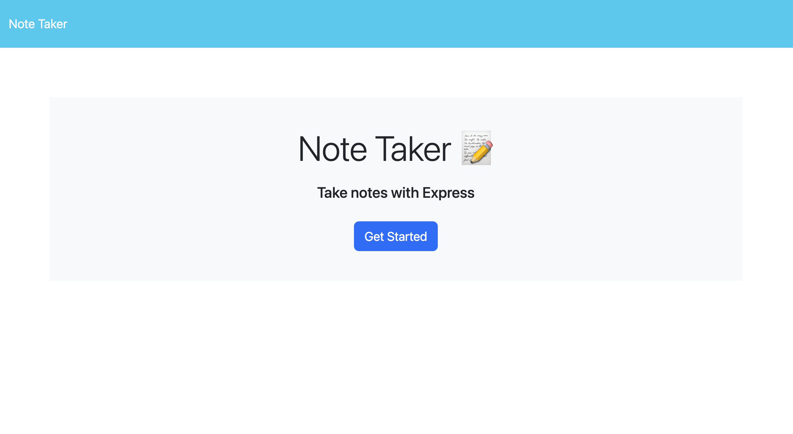
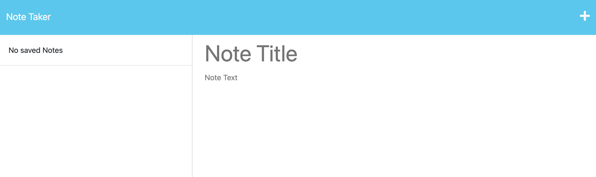

# Note Taker Application

# Weather Dashboard

## Description
This is a Note Take Application. It can be used to write and save notes so people can organize and keep track of tasks to complete. This application can be used for for things such as day to day tasks. 

## Usage

To use:  
1. Follow the link below.  
2. Click on the 'Get Started' button.  
3. Click where it says 'Note Title' and give your note an appropriate title.  
4. After completing step 3, click on 'Note Text' and give a description of the note or task you have stated in your title.  
5. Once both of these fields are populated, you will see a save icon pop up in the right hand corner.
6. Click this save icon to see your note/task poplate in the list on the left side of the screen.
7. The '+' button next to the save button in the top right hand corner will empty both your Note Title field and your Note Text field if you need to restart your note.
  
Below is a link to my deployed Note Taker Application:  
<a href="https://secret-beach-20740.herokuapp.com/">Note Taker Application</a>
 
 
Below is a screenshot of the website you will access with the link above:  

Below is a screenshot of the screen you will see when clicking the 'Get Started' button: 

## Credits

Code was built out with the help of:   

Uconn Tutor: Brandon Leek  
Studygroup Helpers: Matthew Caschetto and Kevin Molyneaux 
Uconn Express Module: Lesson 22: Modular Routing

Reference Pages:  
<a href="https://expressjs.com/en/guide/routing.html#route-parameters"> req.query and params</a>  
<a href="https://zellwk.com/blog/async-await-express/"> Async-Await </a>  
<a href="https://expressjs.com/en/guide/error-handling.html"> Error Handling Try-Catch</a>  
<a href="https://expressjs.com/en/guide/routing.html"> Routing Methods</a>  
<a href="https://nodejs.org/api/fs.html#fs_file_system"> Try-Catch and Promises</a> 
<a href='https://developer.mozilla.org/en-US/docs/Web/JavaScript/Reference/Global_Objects/Array/filter'> Filter</a>